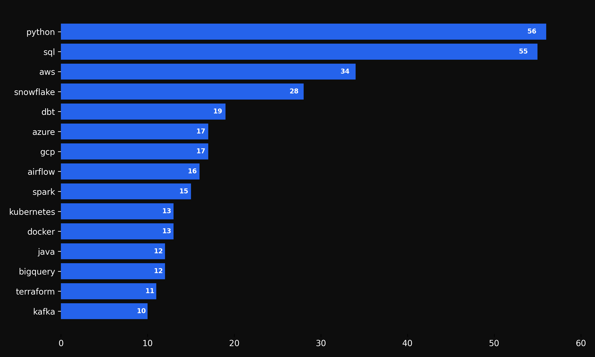
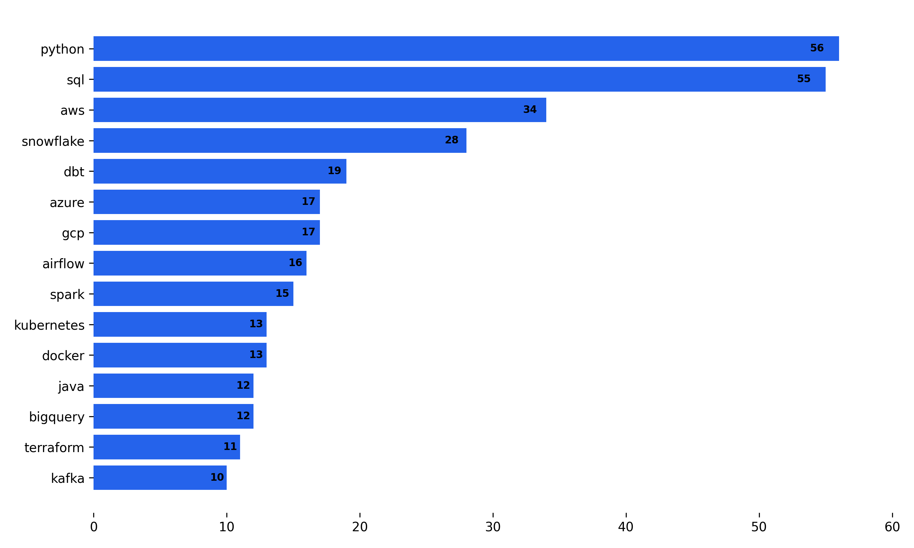

# Projeto: Coletor e Analisador de Vagas para Data Engineer


Este projeto tem como objetivo **coletar vagas reais da internet** relacionadas à Engenharia de Dados, extrair as **skills mais requisitadas** e gerar **gráficos visuais** claros e  prontos para apoiar decisões de carreira.

---

## 🌍 Sobre o projeto

- Coleta vagas via **API pública da Remotive**  
- Processa e limpa os dados com **Pandas & Regex**  
- Conta a frequência de cada tecnologia citada  
- Gera dois gráficos prontos para tema claro/escuro:  
  - `grafico_light_custom.png` (white + blue)  
  - `grafico_dark_custom.png`  (black + blue)  

---

## 📊 Visualizações

### Modo escuro
#### *Top 15 Tecnologias*


### Modo claro
#### *Top 15 Tecnologias*


---

## ⚙️ Tecnologias

| Categoria | Ferramentas |
|-----------|-------------|
| Coleta    | `requests` |
| Parsing   | `beautifulsoup4` |
| Processamento | `pandas`, `re` |
| Visual    | `matplotlib` |

---

## 🚀 Como executar

```bash
# clonando
git clone https://github.com/AdriMayc/Projeto_Vagas_Data_Engineer.git
cd NOME_DO_REPO

# instalando dependências
python -m pip install -r requirements.txt

# 1. coleta
python src/scraper.py

# 2. análise
python src/analise.py

# 3. gráficos
python src/visualizacao.py


